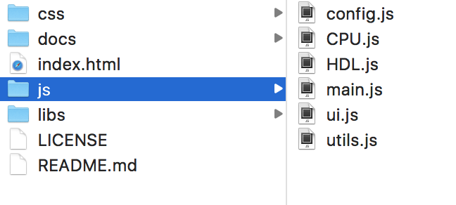
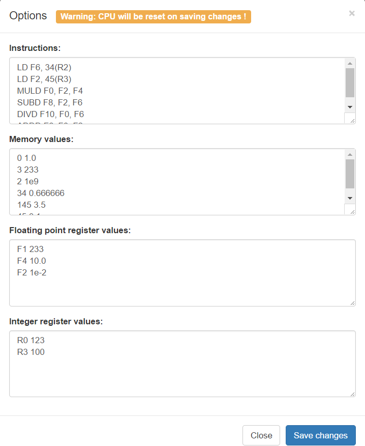
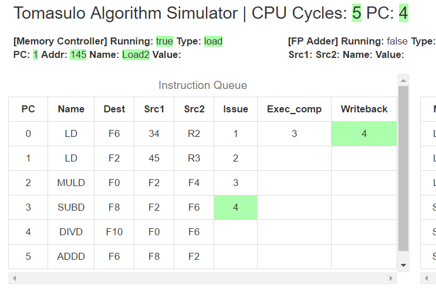

# <Tomasulo Algorithm Simulator> 用户使用手册

## 软件安装和启动

为了获取到较为良好的用户体验，经过多方考量，我们小组决定直接使用一个网页，通过编写`javascript`代码来实现Tomasulo算法模拟器，软件的所有文件如下：

其中，`index.html`既是软件的入口，直接用浏览器打开`index.html`，无须安装其他任何依赖，即可运行本软件。

*注：请使用最新版的Chrome或者Safari浏览器以获取最佳体验。*

## 软件运行截图及功能介绍

软件运行时截图：

为了模拟Tomasulo算法，我们使用`javascript`模拟了一个CPU，**对命令进行硬件级的模拟**；在页面的右上方有5个按钮，我们可以通过这5个按钮控制CPU的行为，包括开关机、启动、暂停和初始化，在页面的中间则是若干表格，描述当前CPU内部的情况，其中“Instruction Queue”表格描述指令队列，“Load/Store Queue”表格表示Tomasulo算法中的存取队列，“Memory”表格则表示内存中对应地址相应的值（注：由于内存一般来说非常大，所以只有被初始化和被修改了的内存块会被显示出来），“Reservation Stations”表格描述Tomasulo算法中的保留站，“Floating Point Registers”和“Integer Registers”则分别描述浮点寄存器和整数寄存器对应的值。

### 5个控制按钮

在页面的右上方，是软件的5个控制按钮，你所需要进行的所有操作均可以通过这5个按钮来实现，它们各自的功能如下：

* 开机关机按钮：默认情况下CPU是关机状态，在关机状态下你可以通过“选项”按钮（详见下文）对CPU进行一些初始化操作；*当你按下此按钮，CPU将由关机状态切换到开机且暂停状态*，此时CPU会根据初始化时设定的内容对页面进行一些设置，比如，操作命令将会被按行解析，分析出每条命令的操作类型、源操作数和目标操作数，然后将其依次放入“Instruction Queue”中，同时也会根据设定的内存值和寄存器值，将“Memory”、“Floating Point Registers”和“Integer Registers”表格中对应的位置进行初始化

* 运行按钮：**只有CPU已开机且处于暂停状态下才能使用此按钮**，点击此按钮CPU将处于自动运行状态，在此种状态下，CPU将以1Hz的时钟运行，并且更新的值会出现绿色的闪烁

* 暂停按钮：当CPU处于自动运行状态时，点击此按钮可以将CPU暂停，此时你可以详细查看当前各个表格中的值，你也可以使用运行按钮继续从当前状态启动CPU，也可以使用单步按钮（详见下文）让CPU继续执行一个时钟周期

* 单步按钮：**只有当CPU处于暂停状态时才可以使用此按钮**，单步按钮既是单步CLK，就是说，每次点击此按钮，都会让CPU执行一个时钟周期；使用此按钮，你可以方便的将CPU运行到你所关心的时钟周期，对于理解Tomasulo算法非常有帮助

* 选项按钮：点击选项按钮，会弹开如下的对话框，在这个弹出框中你可以进行CPU的初始化设置，最上面的文本框是命令编辑框，你可以将你需要执行的命令按行写入此框中；在“Memory values”编辑框中你可以设置内存的初始值，格式是每行两个数字描述一个内存值，每行的前一个数值表示内存地址，第二个值表示该内存中的值；在“Floating point register values”和“Integer register values”编辑框中你可以设置浮点寄存器和整数寄存器的初始值，格式为每行两个用空格隔开的字符串描述一个寄存器，每行的第一个字符串为寄存器的名字，第二个字符串是该寄存器对应的初始值。**注意，在CPU自动运行状态下按下此按钮会将CPU暂停；按下对话框中的“Save changes”按钮将会自动用对话框中设置的内容对CPU进行初始化，此操作会清空之前CPU的状态，请谨慎使用**

### 状态机

上面5个按钮的各个功能可以用以下状态机进行描述：

## 详细介绍

### 闪烁

为了明显的展示每个时钟周期内改变个值，在每次时钟周期切换的时候，被更新的值会出现一个绿色的闪烁，如下图；凭借此闪烁，用户可以更加方便的注意到被修改的值，便于理解Tomasulo算法。

### Instruction Queue

“Instruction Queue”表格在软件的左上方，*在最开始，表格为空，当CPU开机的时候，软件会对初始化中设置的指令列表进行解析，将解析的结果填充到“Instruction Queue”表格中*。表格一共有8列，它们各自的含义如下：

* PC：表示指令的位置
* Name：每条指令固有属性，表示指令的名称
* Dest：每条指令固有属性，表示指令的目的寄存器
* Src1：每条指令固有属性，表示指令的原操作数1
* Src2：每条指令固有属性，表示指令的原操作数2
* Issue：表示在Tomasulo算法中，该指令被发射的时间
* Execution：表示在Tomasulo算法中，该指令运行完成的时间
* Writeback：表示在Tomasulo算法中，该指令结果写回的时间

表格的第2~5项是每条指令的固有属性，在运行过程中不会被改变，第一项PC是根据指令的排列顺序依次从0增加，而后3项是Tomasulo算法中所特有的，在CPU运行过程中会逐渐得出其值。

### Load/Store Queue

“Load/Store Queue”在软件的中上部分，表示Tomasulo算法中的Load Buffer和Store Buffer，其各列的含义如下：

* Name：表示Load Buffer和Store Buffer的名字，在Tomasulo算法的寄存器重命名技术中有重要作用
* Busy：描述当前行的Load Buffer和Store Buffer是否空闲，如果当前行有为完成的任务，则Busy列为Yes
* PC：表示当前行的任务是哪一条指令
* Vk: 只在Store Buffer中存在，表示需要写入的值，如果值未就位，则为空
* Qk: 只在Store Buffer中存在，表示需要写入值的来自哪个保留栈，如果值已就位，则为空
* Addr: 表示Load和Store指令的操作地址

### Memory

“Memory”表格在软件的右上方，描述当前内存的状况，**由于内存一般来说非常大，所以只有被初始化和被修改了的内存块会被显示出来**；“Memory”表格每行描述一块内存，一共两列，其含义如下：

* Addr: 表示内存块的地址
* Value: 表示内存块的值

### Reservation Stations

“Reservation Stations”即对应于Tomasulo算法中的保留栈，在本实验中，一共有3个浮点加减法保留栈和2个浮点乘除法保留栈，故共有5行；“Reservation Stations”表格共有8列，描述5个保留栈的各个属性，其含义如下：

* Name：保留栈的名字，在Tomasulo算法的寄存器重命名中会用到
* Busy：表示当前保留栈是否可以使用，Yes表示当前任务未完成
* Op：表示当前任务的操作名称，和“Instruction Queue”中的Name相同
* PC：表示当前任务是哪一条指令
* Vj: 表示源操作数1的值，如果值未就位则此处为空
* Qj: 表示源操作数1来自哪个保留栈，如果值已就位，则此处为空
* Vk: 表示源操作数2的值，如果值未就位则此处为空
* Qk: 表示源操作数2来自哪个保留栈，如果值已就位，则此处为空

### Floating Point Registers & Integer Registers

“Floating Point Registers”和“Integer Registers”表格描述当前CPU内浮点寄存器和整数寄存器的状态，第一行“Register ID”表示寄存器的标识，第二行“Value”表示对应寄存器的值。