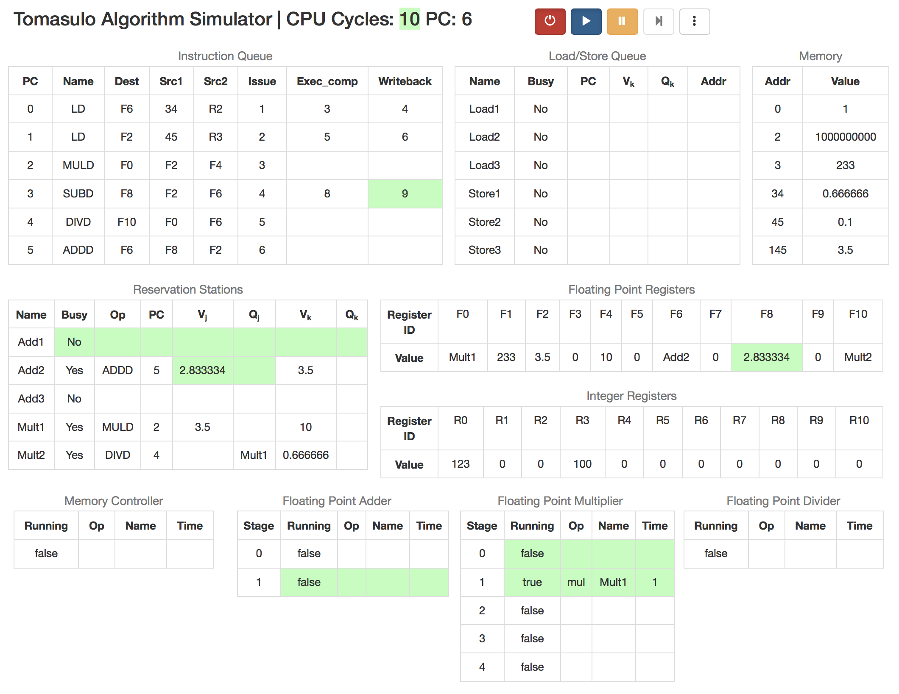
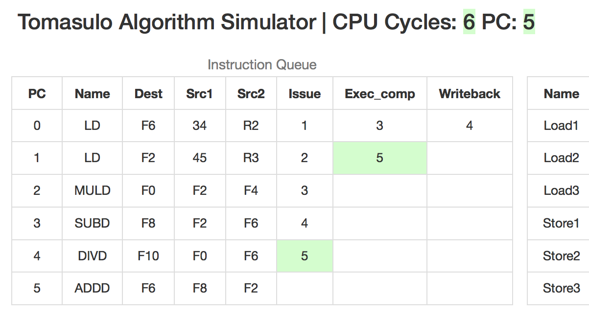

# Tomasulo Algorithm Simulator 用户使用手册

## 软件的运行

本软件是用`JavaScript`和`HTML`实现的，软件的所有文件如下：

其中，`index.html`即是软件的入口，直接用浏览器打开`index.html`，即可运行本软件。

*注：请使用最新版的Chrome或者Safari浏览器以获取最佳体验。*

## 软件功能介绍

软件运行时截图：

为了模拟Tomasulo算法，软件使用`JavaScript`模拟了CPU的运行情况，**对指令进行硬件级的模拟**。

在页面的右上方有5个按钮（详见下文），通过这5个按钮可以控制CPU的行为，包括开关机、运行、暂停和初始化。

在页面的中间则是若干表格，描述当前CPU内部的情况，对应情况如下：

* Instruction Queue：指令队列表格
* Load/Store Queue：Tomasulo算法中的存取队列
* Memory：内存中对应地址及其相应的值（注：由于内存一般来说非常大，所以只有被初始化和被修改了的内存会被显示出来）
* Reservation Stations：Tomasulo算法中的保留站
* Floating Point Registers & Integer Registers：浮点寄存器和整数寄存器对应的值
* Memory Controller：内存控制器运行情况
* Floating Point Adder：浮点加减法部件运行情况
* Floating Point Multiplier：浮点乘法部件运行情况
* Floating Point Divider：浮点除法部件运行情况

**注：在软件模拟的Tomasulo算法中，浮点乘法部件和浮点除法部件可以并行工作，但是它们共用保留站。**

### 5个控制按钮

在页面的右上方，是软件的5个控制按钮，所需进行的所有操作均可以通过这5个按钮来实现，它们各自的功能如下：

* 电源按钮：默认情况下CPU是关机状态，在关机状态下可以通过“选项”按钮（详见下文）对CPU进行一些初始化操作；按下此按钮，CPU将由关机状态切换到开机且暂停状态，此时CPU会根据初始化时设定的内容对页面进行以下设置：
    * CPU的状态清空，寄存器的值变成0
    * 指令会被逐条解析，分析出指令的操作类型、源操作数和目标操作数，然后将其依次放入“Instruction Queue”中
    * 根据设定的内存值，将“Memory”表格中对应的位置进行初始化
    * 根据设定的寄存器值，将“Floating Point Registers”和“Integer Registers”表格中对应的位置进行初始化

* 运行按钮：**只有CPU已开机且处于暂停状态下才能使用此按钮**，按下此按钮，CPU将切换到自动运行状态，在此种状态下，CPU将以每秒钟1个时钟周期的速度运行，并且更新的值会出现绿色的闪烁

* 暂停按钮：当CPU处于自动运行状态时，按下此按钮可以将CPU暂停，此时可以详细查看当前各个表格中的值，可以使用运行按钮继续从当前状态启动CPU，也可以使用单步按钮让CPU单步执行

* 单步按钮：**只有当CPU处于暂停状态时才可以使用此按钮**，每次点击此按钮，都会让CPU执行一个时钟周期。使用此按钮，可以方便地将CPU运行到所需的时钟周期，有助于进一步理解Tomasulo算法

* 选项按钮：点击选项按钮，会弹出如下的对话框，在这个对话框中可以进行CPU的初始化设置：
    * “Instructions”文本框：可以在该文本框输入CPU初始化时的指令，每行一条指令，指令格式详见下文
    * “Memory values”文本框：在此可以设置内存的初始值，每行描述一个值，具体格式是“`地址 浮点数值`”，其中地址的范围为0到4095。注意：请不要输入重复的地址和非法的值
    * “Floating point register values”和“Integer register values”文本框：在此可以设置浮点寄存器和整数寄存器的初始值，每行描述一个值，具体格式是“`寄存器名称 值`”，浮点寄存器的寄存器名称为`F0`到`F10`，整数寄存器的寄存器为`R0`到`R10`
    * 点击“Save changes”按钮将保存这些设置，**注意：该操作会使CPU切换到关机状态并重新加载用户界面**
    * 注：若CPU处于自动运行状态，按下选项按钮会使CPU暂停

### 状态机

上面5个按钮的各个功能可以用以下状态机进行描述：

### 指令说明

目前本模拟器支持以下6条指令，选项对话框中输入的每条指令必须是以下6种指令之一：

1. `ADDD F1, F2, F3`：加法指令，计算`F1=F2+F3`,其中`F1`,`F2`,`F3`均为浮点寄存器的名称
2. `SUBD F1, F2, F3`：减法指令，计算`F1=F2-F3`,其中`F1`,`F2`,`F3`均为浮点寄存器的名称
3. `MULD F1, F2, F3`：乘法指令，计算`F1=F2*F3`,其中`F1`,`F2`,`F3`均为浮点寄存器的名称
4. `DIVD F1, F2, F3`：除法指令，计算`F1=F2/F3`,其中`F1`,`F2`,`F3`均为浮点寄存器的名称
5. `LD F1, offset(R2)`：载入指令，将内存中地址为`R2+offset`的值载入浮点寄存器`F1`,其中`F1`为浮点寄存器的名称，`R2`位整数寄存器的名称，`offset`为一个整数
6. `ST F1, offset(R2)`：储存指令，将浮点寄存器`F1`的值写入内存中地址为`R2+offset`的内存单元，其中`F1`为浮点寄存器的名称，`R2`位整数寄存器的名称，`offset`为一个整数

**注：内存地址的范围为0~4095，请不要试图访问或写入不在此范围的内存单元。**

## 软件详细介绍

### 闪烁

在每个时钟周期，相对于上一个时钟周期被更新的值会出现一个绿色的闪烁，以便用户注意，如下图：

### Instruction Queue

“Instruction Queue”表格在界面的左上方，当CPU开机时，该表格会被填入设置中的所有指令。表格一共有8列，它们各自的含义如下：

* PC：表示该指令的地址
* Name：表示该指令的名称（如`LD`）
* Dest：表示该指令的目的寄存器
* Src1：表示该指令的源操作数1（对于`LD`和`ST`指令，该值为`offset`）
* Src2：表示该指令的源操作数2（对于`LD`和`ST`指令，该值为整数寄存器的名称）
* Issue：表示在Tomasulo算法中，该指令被发射的时刻
* Exec_comp：表示在Tomasulo算法中，该指令运行完成的时刻
* Writeback：表示在Tomasulo算法中，该指令结果写回的时刻

其中，表格的第1列PC根据指令的排列顺序依次从0增加。

### Load/Store Queue

“Load/Store Queue”表格在界面的中上部分，表示Tomasulo算法中的Load Buffer和Store Buffer，其各列的含义如下：

* Name：表示该Load Buffer或Store Buffer的名称，用于Tomasulo算法的寄存器重命名技术
* Busy：表示该Load Buffer或Store Buffer是否空闲，No表示空闲，Yes表示不空闲
* PC：表示该Buffer中指令的地址
* Vk: 只在Store Buffer中有效，表示需要写入的值，如果值未就绪，则为空
* Qk: 只在Store Buffer中有效，表示需要写入值的所在的保留站的名称，如果值已就绪，则为空
* Addr: 表示Load或Store指令的操作地址

### Memory

“Memory”表格在界面的右上方，描述当前内存的状态。该表格每行描述一个内存单元。各列含义如下：

* Addr: 表示该内存单元的地址
* Value: 表示该内存单元的值

**注: 由于内存一般来说非常大，所以只有被初始化了和被修改了的内存单元会被显示出来。**

### Reservation Stations

“Reservation Stations”对应于Tomasulo算法中的保留站。在本实验中，一共有3个浮点加减法保留站和2个浮点乘除法保留站，故共有5行。该表格共有8列，其含义如下：

* Name：保留站的名称，用于Tomasulo算法的寄存器重命名技术
* Busy：表示该保留站是否空闲，No表示空闲，Yes表示不空闲
* Op：表示该保留站中指令的名称
* PC：表示该保留站中指令的地址
* Vj: 表示源操作数1的值，如果该值未就绪则为空
* Qj: 表示源操作数1所在的保留站的名称，如果该值已就绪则为空
* Vk: 表示源操作数2的值，如果该值未就绪则为空
* Qk: 表示源操作数2所在的保留站的名称，如果该值已就绪则为空

### Floating Point Registers 和 Integer Registers

“Floating Point Registers”表格和“Integer Registers”表格描述当前CPU内浮点寄存器和整数寄存器的状态，其中第一行“Register ID”表示寄存器的名称，第二行“Value”表示对应寄存器的值。

### Memory Controller

“Memory Controller”表格描述内存控制器的运行状态，该控制器每次访存共需2周期。表格一共4列，每列的含义如下：

* Running: 表示内存控制器是否在运行，true表示正在运行
* Op: 表示正在进行的访存操作的类型（load或store）
* Name: 表示正在进行的访存操作所在的Load/Store Buffer的名称
* Time: 表示正在进行的访存操作的剩余时间

### Floating Point Adder

“Floating Point Adder”表格描述浮点加减法部件的运行状态，该部件为两段流水线，每段1个时钟周期。表格一共5列，每列含义如下：

* Stage: 表示流水线阶段的编号
* Running: 表示该阶段流水线是否正在运行，true表示正在运行
* Op: 表示该阶段流水线正在执行的操作类型（add或sub）
* Name: 表示该阶段流水线正在执行的指令所在保留站的名称
* Time: 表示该阶段流水线的剩余时间

### Floating Point Multiplier

“Floating Point Multiplier”表格描述当前浮点乘法部件的运行状态，该部件为五段流水线，每段流水线2个时钟周期。表格一共5列，每列含义如下：

* Stage: 表示流水线阶段的编号
* Running: 表示该阶段流水线是否正在运行，true表示正在运行
* Op: 表示该阶段流水线正在执行的操作类型（mul）
* Name: 表示该阶段流水线正在执行的指令所在保留站的名称
* Time: 表示该阶段流水线的剩余时间

### Floating Point Divider

“Floating Point Divider”表格描述当前浮点除法部件的运行状态，该部件每次操作需要40个时钟周期。表格一共4列，每列含义如下：

* Running: 表示该部件是否正在运行，true表示正在运行
* Op: 表示该部件正在执行的操作类型（div）
* Name: 表示该部件正在执行的指令所在保留站的名称
* Time: 表示该部件正在执行的指令的剩余时间